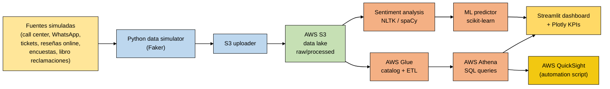

# Customer Satisfaction Analytics

[](#)
[](#)
[](#)
[](#)
[](LICENSE)

> Sistema end-to-end de análisis de satisfacción del cliente sobre arquitectura **Lakehouse en AWS Free Tier** (S3 + Athena + Glue), con dashboard interactivo en Streamlit, modelo ML de análisis de sentimientos, infraestructura como código (Terraform) y políticas de gobernanza (IAM, anonimización, lineaje).

> **🔱 Acerca de este fork:** este repositorio es un fork del proyecto original [`MilaPacompiaM/customer-satisfaction-analytics`](https://github.com/MilaPacompiaM/customer-satisfaction-analytics), donde tuve **autoría principal del código (24 de 30 commits del repositorio original)** como proyecto integrador del **Diplomado Advanced Data Engineer (DMC)**. Este fork mantiene la atribución al equipo original y agrega mejoras de documentación, sanitización de credenciales y limpieza de archivos redundantes.

---

## Tabla de contenido

1. [Demo visual](#1-demo-visual)
2. [Problema de negocio](#2-problema-de-negocio)
3. [Arquitectura](#3-arquitectura)
4. [Stack tecnológico](#4-stack-tecnológico)
5. [Estado de implementación (AS-IS vs TO-BE)](#5-estado-de-implementación-as-is-vs-to-be)
6. [Estructura del repositorio](#6-estructura-del-repositorio)
7. [Setup y prerrequisitos](#7-setup-y-prerrequisitos)
8. [Decisiones técnicas](#8-decisiones-técnicas)
9. [Análisis de costos](#9-análisis-de-costos)
10. [Mi contribución](#10-mi-contribución)
11. [Lecciones aprendidas](#11-lecciones-aprendidas)
12. [Licencia y créditos](#12-licencia-y-créditos)

---

## 1. Demo visual

Dashboard Streamlit con análisis de sentimientos, KPIs de satisfacción y métricas por canal de atención (chat, email, teléfono, presencial). Visualizable en local sin necesidad de cuenta AWS.

```bash
streamlit run streamlit_app.py   # http://localhost:8501
```

---

## 2. Problema de negocio

Necesidad de analizar la satisfacción del cliente a través de **múltiples canales** (chat, email, teléfono, presencial) sin incurrir en costos operativos. Las empresas medianas suelen tener data dispersa en CRMs, hojas de cálculo y sistemas de tickets, sin una vista unificada para tomar decisiones.

**Solución propuesta:** un Lakehouse sobre AWS Free Tier que centraliza, procesa y expone la información en un dashboard accionable, con costo $0.00 garantizado mediante límites de presupuesto y monitoreo automático.

---

## 3. Arquitectura



**Diagramas detallados con iconos AWS** (ambos en `docs/architecture/`):
- 🟢 [`ARQUITECTURA_AS_IS.html`](docs/architecture/ARQUITECTURA_AS_IS.html) — lo que efectivamente se desplegó (banner verde · "DESPLEGADO")
- 🟣 [`ARQUITECTURA_TO_BE.html`](docs/architecture/ARQUITECTURA_TO_BE.html) — diseño empresarial aspiracional inicial (banner violeta · "NO DESPLEGADO")

---

## 4. Stack tecnológico

| Categoría | Tecnología | Detalle |
|---|---|---|
| **Cloud** | AWS Free Tier | S3, Athena, Glue, IAM, AWS Budget, QuickSight |
| **IaC** | Terraform | Despliegue real de la infraestructura AWS |
| **Procesamiento** | Python 3.8+ | Pandas, PySpark (Glue jobs definidos) |
| **Lakehouse** | Parquet + Glue Catalog | 3 capas (raw / processed / curated) |
| **Frontend** | Streamlit + Plotly | Dashboard local con KPIs y filtros |
| **ML / NLP** | NLTK, spaCy, scikit-learn | Sentiment analyzer + satisfaction predictor (definidos) |
| **Gobernanza** | IAM + toolkits Python | Políticas IAM + anonimización + lineaje (toolkits standalone) |
| **CI/CD** | GitHub Actions | Workflows configurados (requirieron ajuste adicional) |

---

## 5. Estado de implementación (AS-IS vs TO-BE)

El proyecto académico atravesó dos arquitecturas: una **TO-BE empresarial aspiracional** (Kinesis, API Gateway, EMR, Redshift Serverless) que se planteó al inicio, y la **AS-IS Free Tier** que efectivamente se construyó y sustentó. El motor real de la entrega fue **Terraform** — todo lo que está en `infra/terraform/main.tf` se aplicó en AWS y de ahí salió el resto del proyecto.

> Ambas arquitecturas tienen un diagrama HTML profesional pareado para comparación visual:
>
> | | Diagrama | Banner |
> |---|---|---|
> | 🟢 AS-IS (desplegado) | [`ARQUITECTURA_AS_IS.html`](docs/architecture/ARQUITECTURA_AS_IS.html) | verde "DESPLEGADO" |
> | 🟣 TO-BE (aspiracional) | [`ARQUITECTURA_TO_BE.html`](docs/architecture/ARQUITECTURA_TO_BE.html) | violeta "NO DESPLEGADO" |
>
> Material complementario del TO-BE original (drawio editable, SVGs, `JUSTIFICACION_TECNICA.md`) se preserva con prefijo `_LEGACY_` en el mismo directorio.

### Componentes — qué se desplegó vs qué quedó como definición

| # | Componente | Estado real |
|---|---|---|
| 1 | **Datos simulados** (7 datasets, 171K registros) — call center, WhatsApp, tickets, reseñas, encuestas, libro de reclamaciones, master de clientes | ✅ Generados con `scripts/data_simulator.py` (Faker, locale es_ES + es_MX) |
| 2 | **Terraform IaC** — S3 (3 buckets), Glue database + crawler, Athena workgroup, IAM roles, AWS Budget alerts | ✅ `terraform apply` ejecutado en cuenta AWS real |
| 3 | **AWS Budget alerts** ($1.00/mes) | ✅ Configurado y activo durante el desarrollo |
| 4 | **Streamlit Dashboard** (KPIs interactivos + Plotly) | ✅ Demo local — primera hoja con datos reales presentada en sustentación |
| 5 | **Anonymization toolkit** (HMAC SHA-256, mascarado de email/phone, regex PII) | ✅ Módulo standalone funcional (probado) |
| 6 | **Data Lineage toolkit** (tracking de transformaciones raw → processed → curated, JSON reports) | ✅ Módulo standalone funcional (probado) |
| 7 | **PySpark / Glue Job** (limpieza, validación, métricas de satisfacción) | 🟡 Definido en código, recurso Glue creado por Terraform |
| 8 | **Sentiment Analyzer** (NLTK + VADER + TextBlob, banking lexicon) | 🟡 Definido en código (616 líneas) |
| 9 | **Satisfaction ML Predictor** (sklearn + Optuna + SHAP) | 🟡 Definido en código, no entrenado |
| 10 | **QuickSight automation** (boto3, dashboards ejecutivos) | 🟡 Definido en código, no presentado en demo |
| 11 | **GitHub Actions CI/CD** (2 workflows: tests + data pipeline) | 🟡 Configurados, ejecutaron parcialmente, requirieron ajustes adicionales |
| 12 | **Streamlit Cloud deploy** | ⚪ No realizado — repositorio público no estuvo a tiempo para deploy |
| 13 | **Docker containerization** | ⚪ Archivos preservados en `docker/`, **no ejecutado** en el proyecto |

**Leyenda:** ✅ desplegado/ejecutado · 🟡 implementado en código (no ejecutado en demo) · ⚪ no realizado.

---

## 6. Estructura del repositorio

```text
customer-satisfaction-analytics/
├── README.md                    ← este archivo
├── LICENSE                      ← MIT (heredado del repo original)
├── streamlit_app.py             ← entrada principal del dashboard
├── run_dashboard.bat            ← script rápido Windows
├── requirements*.txt            ← dependencias por contexto
│
├── analytics/                   ← análisis y modelos
│   ├── streamlit_dashboard/     ← app principal Streamlit
│   ├── ml_models/               ← satisfaction predictor
│   ├── nlp_models/              ← sentiment analyzer
│   ├── exploratory/             ← notebooks Jupyter
│   └── bi_reports/              ← QuickSight automation
│
├── data/                        ← datasets
│   ├── dummy/                   ← samples para tests
│   ├── simulated/               ← generados por Faker (CSV + Parquet)
│   ├── raw/, processed/, external/  ← capas del lakehouse
│
├── docs/                        ← documentación + arquitectura
│   ├── architecture/
│   │   ├── ARQUITECTURA_AS_IS.html   ← diagrama oficial actual (HTML+SVG)
│   │   ├── DIAGRAMA_ARQUITECTURA_DETALLADO.md  ← scope real implementado
│   │   └── _LEGACY_*                        ← arquitectura aspiracional inicial (no implementada)
│   ├── infrastructure/, deployment/, costs/
│   └── README.md, context.md, project_summary.md
│
├── infra/                       ← Infrastructure-as-Code
│   └── terraform/               ← main.tf, variables.tf, *.tfvars.example
│
├── ingestion/                   ← scripts de carga
│   ├── scripts/s3_uploader.py
│   └── sql/01_create_tables.sql
│
├── processing/                  ← jobs PySpark
│   └── pyspark_jobs/data_processing_job.py
│
├── governance/                  ← seguridad y gobernanza
│   ├── POLITICAS.md             ← políticas formales del proyecto
│   ├── anonymization/           ← funciones de anonimización (toolkit)
│   ├── lineage/                 ← tracking de lineaje de datos (toolkit)
│   └── security_policies/       ← políticas IAM (JSON)
│
├── docker/                      ← containerización (preservado, no ejecutado)
│   ├── README.md                ← nota explicativa
│   ├── Dockerfile
│   ├── docker-compose.yml
│   └── entrypoint.sh
│
├── scripts/                     ← utilidades
│   ├── data_simulator.py        ← genera CSVs simulados (Faker)
│   ├── aws_cost_monitor.py      ← monitoreo de costos AWS
│   ├── generate_diagrams.py     ← genera SVGs de arquitectura
│   ├── setup_account.py         ← bootstrap inicial de cuenta AWS
│   ├── setup_free_tier.py       ← optimización Free Tier
│   ├── setup_external_services.py
│   └── configurar_servicios_rapido.py
│
├── storage/                     ← samples del lakehouse
└── tests/                       ← tests unitarios e integración
```

---

## 7. Setup y prerrequisitos

### Requisitos

- Python 3.8 o superior
- Git
- (Opcional para AWS) Cuenta AWS con Free Tier + Terraform CLI

### Inicio rápido (modo local sin AWS)

```bash
# 1. Clonar el fork
git clone https://github.com/Paradox10101/customer-satisfaction-analytics.git
cd customer-satisfaction-analytics

# 2. Crear entorno virtual
python -m venv .venv
.venv\Scripts\activate           # Windows
# source .venv/bin/activate      # Linux/Mac

# 3. Instalar dependencias
pip install -r requirements-streamlit.txt

# 4. Generar datos simulados (primera vez)
python scripts/data_simulator.py

# 5. Levantar dashboard
streamlit run streamlit_app.py
# http://localhost:8501
```

### Despliegue AWS (opcional)

```bash
# 1. Configurar credenciales AWS
aws configure

# 2. Copiar plantilla de variables
cd infra/terraform
cp terraform.tfvars.example terraform.tfvars
# Editar terraform.tfvars con tus valores reales (NO commitear)

# 3. Desplegar
terraform init
terraform plan
terraform apply
```

**Costo proyectado:** $0.00/mes dentro del Free Tier (S3 < 5 GB, Athena < 5 GB scan, Glue < 1M DPU-hours).

---

## 8. Decisiones técnicas

| Decisión | Justificación |
|---|---|
| **AWS Free Tier como restricción de diseño** | Forzar arquitectura cost-aware. La mayoría de proyectos académicos asumen presupuesto ilimitado; este demuestra ingeniería bajo limitaciones reales |
| **Datos simulados con Faker** | Reproducibilidad sin depender de datasets externos que pueden cambiar/desaparecer |
| **Streamlit antes que Power BI / QuickSight** | Hosting gratuito en Streamlit Cloud, sin licencias |
| **Athena antes que Redshift** | Pay-per-query, ideal para Free Tier (Redshift cuesta $0.25/h mínimo) |
| **Terraform antes que CloudFormation** | Multi-cloud y mejor experiencia de desarrollo |
| **Anonimización en governance/** | PII (Personally Identifiable Information) eliminada antes de procesamiento |
| **Tests unitarios en tests/** | Validación automática de funciones críticas (anonimización, ETL) |

---

## 9. Análisis de costos

| Servicio AWS | Free Tier | Uso del proyecto | Costo |
|---|---|---|---|
| S3 | 5 GB | < 100 MB | $0.00 |
| Athena | 5 GB scan/mes | < 10 MB scan | $0.00 |
| Glue | 1M DPU-hours | < 2 horas | $0.00 |
| QuickSight | 4 usuarios autor | 1 usuario | $0.00 |
| **Total mensual** | — | — | **$0.00** |

Detalle completo en [`docs/costs/COSTOS.md`](docs/costs/COSTOS.md).

**Protección anti-costos:** AWS Budget configurado a $1.00/mes con alertas automáticas.

---

## 10. Mi contribución

Como contribuidor principal del repositorio original (24 de 30 commits = ~80%), mi aporte cubrió:

- **Arquitectura inicial del proyecto:** estructura de carpetas, `data_simulator.py`, sentiment analyzer
- **Streamlit dashboard:** desarrollo completo de la app interactiva con KPIs y filtros
- **AWS automation:** scripts `aws_cost_monitor.py`, `setup_account_*.py`, QuickSight automation
- **ML modeling:** `satisfaction_predictor.py` con scikit-learn
- **Infraestructura como código:** Terraform (`main.tf`, `variables.tf`, configuración Free Tier)
- **CI/CD:** pipelines de GitHub Actions (tests, data pipeline)
- **Documentación de arquitectura:** diagrama oficial (`ARQUITECTURA_AS_IS.html`), descripción detallada (`DIAGRAMA_ARQUITECTURA_DETALLADO.md`) y archivos legacy de la arquitectura aspiracional inicial
- **Gobernanza:** scripts de anonimización y lineaje
- **Migración cost-free:** transición de configuraciones costosas a Free Tier garantizado

Contribuciones verificables vía:

```bash
git log --author="Paradox\|Edgardo\|Solis" --oneline | wc -l   # 24 commits
```

---

## 11. Lecciones aprendidas

- **El AWS Free Tier es más restrictivo de lo que parece.** Diseñar para él obliga a tomar decisiones técnicas que, paradójicamente, suelen ser más limpias (menos overhead, mejor arquitectura).
- **Anonimizar antes de procesar es más fácil que después.** Implementarlo como primer paso del pipeline ahorra dolores de cabeza en gobernanza más adelante.
- **Diagramas con iconos oficiales > diagramas genéricos.** Los reclutadores técnicos reconocen los iconos de AWS al instante.
- **Documentar costos proyectados es un diferenciador.** Pocos proyectos académicos incluyen análisis de costos; los hiring managers lo valoran como señal de pensamiento de producción.
- **Trabajar en equipo con git: ramas separadas + PRs.** Evita conflictos pero requiere disciplina con merges (lección aprendida cuando una rama "Edgardo" experimental quiso introducir cambios destructivos).

---

## 12. Licencia y créditos

**Licencia:** MIT (heredada del repositorio original — ver [`LICENSE`](LICENSE)).

**Repositorio original:** [`MilaPacompiaM/customer-satisfaction-analytics`](https://github.com/MilaPacompiaM/customer-satisfaction-analytics)

**Equipo del proyecto académico (Diplomado DMC):** Mila Pacompia Mendoza, Edgardo Solis Cornelio, y otros colaboradores.

**Mantenimiento de este fork:** Edgardo Solis Cornelio ([@Paradox10101](https://github.com/Paradox10101)) — sanitización de credenciales, mejora de README, organización de archivos.

---

## Aviso de seguridad

- **Credenciales sanitizadas** antes de hacer público este fork (AWS Account IDs, emails personales, encrypted credentials reemplazados por placeholders).
- Archivos `.tfvars`, `.tfstate`, `.terraform/` excluidos vía `.gitignore`.
- La cuenta AWS utilizada durante el desarrollo era una suscripción gratuita de prueba **ya finalizada**; los recursos no existen actualmente.
- Para reproducir el proyecto, configurar credenciales propias (ver `infra/terraform/terraform.tfvars.example`).
