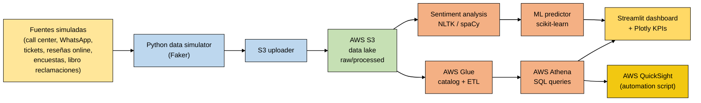

# Customer Satisfaction Analytics

[](#)
[](#)
[](#)
[](#)
[](LICENSE)

> Sistema end-to-end de análisis de satisfacción del cliente sobre arquitectura **Lakehouse en AWS Free Tier** (S3 + Athena + Glue), con dashboard interactivo en Streamlit, modelo ML de análisis de sentimientos, infraestructura como código (Terraform) y políticas de gobernanza (IAM, anonimización, lineaje).

> **🔱 Acerca de este fork:** este repositorio es un fork del proyecto original [`MilaPacompiaM/customer-satisfaction-analytics`](https://github.com/MilaPacompiaM/customer-satisfaction-analytics), donde tuve **autoría principal del código (24 de 30 commits del repositorio original)** como proyecto integrador del **Diplomado Advanced Data Engineer (DMC)**. Este fork mantiene la atribución al equipo original y agrega mejoras de documentación, sanitización de credenciales y limpieza de archivos redundantes.

---

## Tabla de contenido

1. [Demo visual](#1-demo-visual)
2. [Problema de negocio](#2-problema-de-negocio)
3. [Arquitectura](#3-arquitectura)
4. [Stack tecnológico](#4-stack-tecnológico)
5. [Estructura del repositorio](#5-estructura-del-repositorio)
6. [Setup y prerrequisitos](#6-setup-y-prerrequisitos)
7. [Decisiones técnicas](#7-decisiones-técnicas)
8. [Análisis de costos](#8-análisis-de-costos)
9. [Mi contribución](#9-mi-contribución)
10. [Lecciones aprendidas](#10-lecciones-aprendidas)
11. [Licencia y créditos](#11-licencia-y-créditos)

---

## 1. Demo visual

Dashboard Streamlit con análisis de sentimientos, KPIs de satisfacción y métricas por canal de atención (chat, email, teléfono, presencial). Visualizable en local sin necesidad de cuenta AWS.

```bash
streamlit run streamlit_app.py   # http://localhost:8501
```

---

## 2. Problema de negocio

Necesidad de analizar la satisfacción del cliente a través de **múltiples canales** (chat, email, teléfono, presencial) sin incurrir en costos operativos. Las empresas medianas suelen tener data dispersa en CRMs, hojas de cálculo y sistemas de tickets, sin una vista unificada para tomar decisiones.

**Solución propuesta:** un Lakehouse sobre AWS Free Tier que centraliza, procesa y expone la información en un dashboard accionable, con costo $0.00 garantizado mediante límites de presupuesto y monitoreo automático.

---

## 3. Arquitectura



**Diagrama detallado con iconos AWS:** ver [`docs/architecture/ARQUITECTURA_OFICIAL.html`](docs/architecture/ARQUITECTURA_OFICIAL.html) o [`ARQUITECTURA_OFICIAL.drawio`](docs/architecture/ARQUITECTURA_OFICIAL.drawio) (editable en [draw.io](https://app.diagrams.net)).

---

## 4. Stack tecnológico

| Categoría | Tecnología | Detalle |
|---|---|---|
| **Cloud** | AWS Free Tier | S3, Athena, Glue, IAM, QuickSight |
| **Procesamiento** | Python 3.8+ | Pandas, PySpark (jobs opcionales) |
| **Lakehouse** | Delta Lake samples | Parquet + Glue Catalog |
| **Frontend** | Streamlit + Plotly | Dashboard interactivo, KPIs |
| **ML** | NLTK, spaCy, scikit-learn | Análisis de sentimientos + predictor de satisfacción |
| **IaC** | Terraform | Despliegue completo de infraestructura AWS |
| **Containerización** | Docker + docker-compose | Para entorno reproducible |
| **Gobernanza** | IAM policies + scripts custom | Anonimización + lineaje de datos |
| **CI/CD** | GitHub Actions | Pipeline de tests y data |

---

## 5. Estructura del repositorio

```text
customer-satisfaction-analytics/
├── README.md                    ← este archivo
├── LICENSE                      ← Apache 2.0 (heredado del fork)
├── streamlit_app.py             ← entrada principal del dashboard
├── run_dashboard.bat            ← script rápido Windows
├── requirements*.txt            ← dependencias por contexto
│
├── analytics/                   ← análisis y modelos
│   ├── streamlit_dashboard/     ← app principal Streamlit
│   ├── ml_models/               ← satisfaction predictor
│   ├── nlp_models/              ← sentiment analyzer
│   ├── exploratory/             ← notebooks Jupyter
│   └── bi_reports/              ← QuickSight automation
│
├── data/                        ← datasets
│   ├── dummy/                   ← samples para tests
│   ├── simulated/               ← generados por Faker (CSV + Parquet)
│   ├── raw/, processed/, external/  ← capas del lakehouse
│
├── docs/                        ← documentación + arquitectura
│   ├── architecture/
│   │   ├── ARQUITECTURA_OFICIAL.html    ← diagrama final con iconos AWS
│   │   ├── ARQUITECTURA_OFICIAL.drawio  ← source editable (draw.io)
│   │   ├── ARQUITECTURA_TO_BE.md        ← descripción narrativa
│   │   ├── DIAGRAMA_ARQUITECTURA_DETALLADO.md
│   │   ├── JUSTIFICACION_TECNICA.md
│   │   └── *.svg                        ← versiones SVG de diagramas
│   ├── infrastructure/, deployment/, costs/
│   └── README.md, context.md, project_summary.md
│
├── infra/                       ← Infrastructure-as-Code
│   ├── terraform/               ← main.tf, variables.tf, *.tfvars.example
│   └── cdk/                     ← (legacy CDK, no activo)
│
├── ingestion/                   ← scripts de carga
│   ├── scripts/s3_uploader.py
│   ├── sql/01_create_tables.sql
│   └── aws_glue_jobs/, configs/
│
├── processing/                  ← jobs PySpark + SQL transformations
│
├── governance/                  ← seguridad y gobernanza
│   ├── anonymization/           ← funciones de anonimización
│   ├── lineage/                 ← tracking de lineaje de datos
│   └── security_policies/       ← políticas IAM
│
├── docker/                      ← containerización
│   ├── Dockerfile
│   ├── docker-compose.yml
│   └── entrypoint.sh
│
├── scripts/                     ← utilidades
│   ├── data_simulator.py        ← genera CSVs simulados (Faker)
│   ├── aws_cost_monitor.py      ← monitoreo de costos AWS
│   ├── diagram_generator.py     ← genera SVGs de arquitectura
│   └── setup_*.py               ← bootstrap de cuenta AWS
│
├── storage/                     ← samples del lakehouse
└── tests/                       ← tests unitarios e integración
```

---

## 6. Setup y prerrequisitos

### Requisitos

- Python 3.8 o superior
- Git
- (Opcional para AWS) Cuenta AWS con Free Tier + Terraform CLI

### Inicio rápido (modo local sin AWS)

```bash
# 1. Clonar el fork
git clone https://github.com/Paradox10101/customer-satisfaction-analytics.git
cd customer-satisfaction-analytics

# 2. Crear entorno virtual
python -m venv .venv
.venv\Scripts\activate           # Windows
# source .venv/bin/activate      # Linux/Mac

# 3. Instalar dependencias
pip install -r requirements-streamlit.txt

# 4. Generar datos simulados (primera vez)
python scripts/data_simulator.py

# 5. Levantar dashboard
streamlit run streamlit_app.py
# http://localhost:8501
```

### Despliegue AWS (opcional)

```bash
# 1. Configurar credenciales AWS
aws configure

# 2. Copiar plantilla de variables
cd infra/terraform
cp terraform.tfvars.example terraform.tfvars
# Editar terraform.tfvars con tus valores reales (NO commitear)

# 3. Desplegar
terraform init
terraform plan
terraform apply
```

**Costo proyectado:** $0.00/mes dentro del Free Tier (S3 < 5 GB, Athena < 5 GB scan, Glue < 1M DPU-hours).

---

## 7. Decisiones técnicas

| Decisión | Justificación |
|---|---|
| **AWS Free Tier como restricción de diseño** | Forzar arquitectura cost-aware. La mayoría de proyectos académicos asumen presupuesto ilimitado; este demuestra ingeniería bajo limitaciones reales |
| **Datos simulados con Faker** | Reproducibilidad sin depender de datasets externos que pueden cambiar/desaparecer |
| **Streamlit antes que Power BI / QuickSight** | Hosting gratuito en Streamlit Cloud, sin licencias |
| **Athena antes que Redshift** | Pay-per-query, ideal para Free Tier (Redshift cuesta $0.25/h mínimo) |
| **Terraform antes que CloudFormation** | Multi-cloud y mejor experiencia de desarrollo |
| **Anonimización en governance/** | PII (Personally Identifiable Information) eliminada antes de procesamiento |
| **Tests unitarios en tests/** | Validación automática de funciones críticas (anonimización, ETL) |

---

## 8. Análisis de costos

| Servicio AWS | Free Tier | Uso del proyecto | Costo |
|---|---|---|---|
| S3 | 5 GB | < 100 MB | $0.00 |
| Athena | 5 GB scan/mes | < 10 MB scan | $0.00 |
| Glue | 1M DPU-hours | < 2 horas | $0.00 |
| QuickSight | 4 usuarios autor | 1 usuario | $0.00 |
| **Total mensual** | — | — | **$0.00** |

Detalle completo en [`docs/costs/COSTOS.md`](docs/costs/COSTOS.md).

**Protección anti-costos:** AWS Budget configurado a $1.00/mes con alertas automáticas.

---

## 9. Mi contribución

Como contribuidor principal del repositorio original (24 de 30 commits = ~80%), mi aporte cubrió:

- **Arquitectura inicial del proyecto:** estructura de carpetas, `data_simulator.py`, sentiment analyzer
- **Streamlit dashboard:** desarrollo completo de la app interactiva con KPIs y filtros
- **AWS automation:** scripts `aws_cost_monitor.py`, `setup_account_*.py`, QuickSight automation
- **ML modeling:** `satisfaction_predictor.py` con scikit-learn
- **Infraestructura como código:** Terraform (`main.tf`, `variables.tf`, configuración Free Tier)
- **CI/CD:** pipelines de GitHub Actions (tests, data pipeline)
- **Documentación de arquitectura:** diagramas detallados (drawio + SVG + HTML), `JUSTIFICACION_TECNICA.md`, `ARQUITECTURA_TO_BE.md`
- **Gobernanza:** scripts de anonimización y lineaje
- **Migración cost-free:** transición de configuraciones costosas a Free Tier garantizado

Contribuciones verificables vía:

```bash
git log --author="Paradox\|Edgardo\|Solis" --oneline | wc -l   # 24 commits
```

---

## 10. Lecciones aprendidas

- **El AWS Free Tier es más restrictivo de lo que parece.** Diseñar para él obliga a tomar decisiones técnicas que, paradójicamente, suelen ser más limpias (menos overhead, mejor arquitectura).
- **Anonimizar antes de procesar es más fácil que después.** Implementarlo como primer paso del pipeline ahorra dolores de cabeza en gobernanza más adelante.
- **Diagramas con iconos oficiales > diagramas genéricos.** Los reclutadores técnicos reconocen los iconos de AWS al instante.
- **Documentar costos proyectados es un diferenciador.** Pocos proyectos académicos incluyen análisis de costos; los hiring managers lo valoran como señal de pensamiento de producción.
- **Trabajar en equipo con git: ramas separadas + PRs.** Evita conflictos pero requiere disciplina con merges (lección aprendida cuando una rama "Edgardo" experimental quiso introducir cambios destructivos).

---

## 11. Licencia y créditos

**Licencia:** Apache 2.0 (heredada del repositorio original).

**Repositorio original:** [`MilaPacompiaM/customer-satisfaction-analytics`](https://github.com/MilaPacompiaM/customer-satisfaction-analytics)

**Equipo del proyecto académico (Diplomado DMC):** Mila Pacompia Mendoza, Edgardo Solis Cornelio, y otros colaboradores.

**Mantenimiento de este fork:** Edgardo Solis Cornelio ([@Paradox10101](https://github.com/Paradox10101)) — sanitización de credenciales, mejora de README, organización de archivos.

---

## Aviso de seguridad

- **Credenciales sanitizadas** antes de hacer público este fork (AWS Account IDs, emails personales, encrypted credentials reemplazados por placeholders).
- Archivos `.tfvars`, `.tfstate`, `.terraform/` excluidos vía `.gitignore`.
- La cuenta AWS utilizada durante el desarrollo era una suscripción gratuita de prueba **ya finalizada**; los recursos no existen actualmente.
- Para reproducir el proyecto, configurar credenciales propias (ver `infra/terraform/terraform.tfvars.example`).
