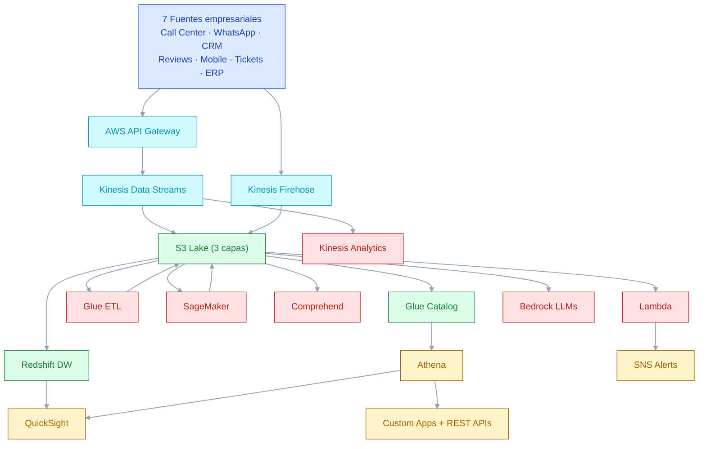

# 🏗️ Arquitectura **TO-BE** (Aspiracional) — Customer Satisfaction Analytics Platform

> 🟣 **TO-BE · NO IMPLEMENTADA** — Este documento describe la **arquitectura objetivo aspiracional** que se diseñó al inicio del proyecto pero **no se construyó** por restricciones de presupuesto (Free Tier) y tiempo del diplomado. Para la arquitectura realmente desplegada ver [`DIAGRAMA_ARQUITECTURA_DETALLADO.md`](DIAGRAMA_ARQUITECTURA_DETALLADO.md) y el diagrama HTML [`ARQUITECTURA_AS_IS.html`](ARQUITECTURA_AS_IS.html).

## Diagrama TO-BE simplificado (Mermaid)



## 🎯 **Visión General**

Esta es la arquitectura objetivo completa para una plataforma empresarial de análisis de satisfacción del cliente, diseñada para escalabilidad, tiempo real y capacidades de ML avanzadas.

---

## 🔵 **DIAGRAMA DE ARQUITECTURA COMPLETA**

```
┌─────────────────────────────────────────────────────────────────────────────────────────────────────┐
│                           🏢 CUSTOMER SATISFACTION ANALYTICS PLATFORM                               │
│                                    ARQUITECTURA TO BE                                               │
└─────────────────────────────────────────────────────────────────────────────────────────────────────┘
                                                │
                            ┌───────────────────┼───────────────────┐
                            │                   │                   │
                    ┌───────▼────────┐ ┌───────▼────────┐ ┌───────▼────────┐
                    │  📥 INGESTION  │ │  🧠 PROCESSING │ │  📊 ANALYTICS  │
                    │    LAYER       │ │     LAYER      │ │     LAYER      │
                    └───────┬────────┘ └───────┬────────┘ └───────┬────────┘
                            │                   │                   │
         ┌──────────────────┼──────────────────┼──────────────────┼──────────────────┐
         │                  │                  │                  │                  │
    ┌────▼───┐      ┌──────▼──────┐    ┌─────▼─────┐      ┌─────▼─────┐      ┌────▼───┐
    │🌐 APIs │      │📱 Mobile    │    │⚡ Stream  │      │🤖 ML/AI   │      │📈 BI   │
    │        │      │   Apps      │    │Processing │      │ Pipeline  │      │Reports │
    └────┬───┘      └──────┬──────┘    └─────┬─────┘      └─────┬─────┘      └────┬───┘
         │                  │                │                  │                  │
         └──────────────────┼──────────────┬─┼──────────────────┼──────────────────┘
                           │              │ │                  │
        ┌─────────────────────────────────────────────────────────────────────────────┐
        │                        🏗️ AWS CLOUD INFRASTRUCTURE                          │
        └─────────────────────────────────────────────────────────────────────────────┘
```

---

## 🔄 **FLUJO DE DATOS DETALLADO**

### **1. 📥 CAPA DE INGESTA (Data Ingestion)**

```
┌─────────────────────────────────────────────────────────────────────────────────────┐
│                              📥 INGESTION LAYER                                    │
├─────────────────────────────────────────────────────────────────────────────────────┤
│                                                                                     │
│  🔵 FUENTES DE DATOS EXTERNAS              🔵 FUENTES INTERNAS                     │
│  ┌──────────────────────────┐              ┌──────────────────────────┐            │
│  │ 📞 Call Center APIs      │◄────────────►│ 💾 CRM Database         │            │
│  │ 💬 WhatsApp Business     │              │ 🎫 Ticketing System     │            │
│  │ ✉️ Email Support        │              │ 📋 Survey Platform      │            │
│  │ 🌐 Social Media APIs    │              │ 🏪 POS Systems          │            │
│  │ ⭐ Review Platforms     │              │ 💳 Payment Gateways     │            │
│  │ 📱 Mobile Apps          │              │ 📊 ERP Systems          │            │
│  └──────────────────────────┘              └──────────────────────────┘            │
│                │                                          │                        │
│                └─────────────┐              ┌─────────────┘                        │
│                              │              │                                      │
│              ┌───────────────▼──────────────▼───────────────┐                     │
│              │        🚀 AWS API GATEWAY                     │                     │
│              │     • Rate Limiting                          │                     │
│              │     • Authentication                         │                     │
│              │     • Request Validation                     │                     │
│              │     • Logging & Monitoring                   │                     │
│              └───────────────┬──────────────────────────────┘                     │
│                              │                                                    │
│              ┌───────────────▼──────────────────────────────┐                     │
│              │        ⚡ AWS KINESIS DATA STREAMS          │                     │
│              │     • Real-time data ingestion              │                     │
│              │     • Auto-scaling                          │                     │
│              │     • Multiple consumers                    │                     │
│              │     • Data retention (7 days)               │                     │
│              └───────────────┬──────────────────────────────┘                     │
│                              │                                                    │
│  ┌───────────────────────────▼───────────────────────────┐                       │
│  │              🔄 AWS KINESIS DATA FIREHOSE             │                       │
│  │           • Batch processing                          │                       │
│  │           • Data transformation                       │                       │
│  │           • Compression & format conversion           │                       │
│  │           • Direct S3 delivery                        │                       │
│  └───────────────────────────┬───────────────────────────┘                       │
│                              │                                                    │
│              ┌───────────────▼──────────────────────────────┐                     │
│              │         📦 RAW DATA STORAGE                  │                     │
│              │       S3://raw-data-bucket                   │                     │
│              │     • Partitioned by date/source            │                     │
│              │     • Multiple formats (JSON, Parquet)      │                     │
│              │     • Lifecycle policies                    │                     │
│              └──────────────────────────────────────────────┘                     │
└─────────────────────────────────────────────────────────────────────────────────────┘
```

### **2. 🧠 CAPA DE PROCESAMIENTO (Data Processing)**

```
┌─────────────────────────────────────────────────────────────────────────────────────┐
│                             🧠 PROCESSING LAYER                                    │
├─────────────────────────────────────────────────────────────────────────────────────┤
│                                                                                     │
│  ⚡ STREAM PROCESSING               🔄 BATCH PROCESSING                              │
│  ┌──────────────────────────┐      ┌──────────────────────────┐                    │
│  │   AWS KINESIS ANALYTICS  │      │      AWS GLUE ETL        │                    │
│  │ • Real-time aggregations │      │ • Data cleaning          │                    │
│  │ • Window functions       │      │ • Schema validation      │                    │
│  │ • Complex event proc.   │      │ • Data enrichment        │                    │
│  │ • Alerting triggers      │      │ • Format standardization │                    │
│  └──────────┬───────────────┘      └──────────┬───────────────┘                    │
│             │                                 │                                    │
│  ┌──────────▼───────────────┐      ┌──────────▼───────────────┐                    │
│  │   🚨 REAL-TIME ALERTS    │      │   📊 PROCESSED DATA      │                    │
│  │ • SNS Notifications      │      │ S3://processed-bucket    │                    │
│  │ • Lambda triggers        │      │ • Cleaned & enriched     │                    │
│  │ • Dashboard updates      │      │ • Parquet format         │                    │
│  └──────────┬───────────────┘      └──────────┬───────────────┘                    │
│             │                                 │                                    │
│             └─────────────┐         ┌─────────┘                                    │
│                           │         │                                              │
│               ┌───────────▼─────────▼──────────────┐                               │
│               │        🤖 ML PIPELINE              │                               │
│               │   AWS SAGEMAKER + LAMBDA           │                               │
│               │ • Sentiment Analysis               │                               │
│               │ • Topic Classification             │                               │
│               │ • Anomaly Detection                │                               │
│               │ • Predictive Scoring               │                               │
│               │ • Auto-retraining                  │                               │
│               └───────────┬────────────────────────┘                               │
│                           │                                                        │
│               ┌───────────▼────────────────────────┐                               │
│               │     📈 ENRICHED DATA LAKE          │                               │
│               │   S3://analytics-ready-bucket      │                               │
│               │ • ML predictions                   │                               │
│               │ • Sentiment scores                 │                               │
│               │ • Risk classifications             │                               │
│               │ • Recommendation scores            │                               │
│               └────────────────────────────────────┘                               │
└─────────────────────────────────────────────────────────────────────────────────────┘
```

### **3. 📊 CAPA DE ANALÍTICA (Analytics Layer)**

```
┌─────────────────────────────────────────────────────────────────────────────────────┐
│                            📊 ANALYTICS LAYER                                      │
├─────────────────────────────────────────────────────────────────────────────────────┤
│                                                                                     │
│  🔍 QUERY ENGINE                    📈 VISUALIZATION                               │
│  ┌──────────────────────────┐      ┌──────────────────────────┐                    │
│  │     AWS ATHENA           │      │    AMAZON QUICKSIGHT     │                    │
│  │ • SQL on S3 data         │◄────►│ • Interactive dashboards │                    │
│  │ • Partitioned queries    │      │ • Real-time updates      │                    │
│  │ • Cost optimization      │      │ • Mobile responsive      │                    │
│  │ • Concurrent users       │      │ • Embedded analytics     │                    │
│  └──────────┬───────────────┘      └──────────┬───────────────┘                    │
│             │                                 │                                    │
│  ┌──────────▼───────────────┐      ┌──────────▼───────────────┐                    │
│  │   🗃️ DATA WAREHOUSE      │      │   📱 CUSTOM APPS         │                    │
│  │    AWS REDSHIFT          │      │ • React Dashboard        │                    │
│  │ • OLAP queries           │      │ • Streamlit Apps         │                    │
│  │ • Historical analysis    │      │ • Mobile Apps            │                    │
│  │ • Complex aggregations   │      │ • API endpoints          │                    │
│  │ • BI tool integration    │      │ • Automated reports      │                    │
│  └──────────┬───────────────┘      └──────────┬───────────────┘                    │
│             │                                 │                                    │
│             └─────────────┐         ┌─────────┘                                    │
│                           │         │                                              │
│               ┌───────────▼─────────▼──────────────┐                               │
│               │        📋 REPORTING SUITE          │                               │
│               │ • Executive dashboards             │                               │
│               │ • Operational reports              │                               │
│               │ • Customer insights                │                               │
│               │ • Performance metrics              │                               │
│               │ • Predictive analytics             │                               │
│               └────────────────────────────────────┘                               │
└─────────────────────────────────────────────────────────────────────────────────────┘
```

---

## 🛡️ **CAPAS TRANSVERSALES**

### **🔐 SEGURIDAD Y GOVERNANCE**

```
┌─────────────────────────────────────────────────────────────────────────────────────┐
│                           🛡️ SECURITY & GOVERNANCE                                │
├─────────────────────────────────────────────────────────────────────────────────────┤
│                                                                                     │
│  🔑 IDENTITY & ACCESS           🛡️ DATA PROTECTION                                 │
│  ┌──────────────────────────┐  ┌──────────────────────────┐                        │
│  │    AWS IAM + COGNITO     │  │      ENCRYPTION          │                        │
│  │ • Role-based access      │  │ • At rest (S3, RDS)     │                        │
│  │ • Multi-factor auth      │  │ • In transit (TLS/SSL)  │                        │
│  │ • API authentication    │  │ • Key management (KMS)   │                        │
│  │ • Single sign-on        │  │ • Data masking          │                        │
│  └──────────────────────────┘  └──────────────────────────┘                        │
│                                                                                     │
│  📋 COMPLIANCE                  🕵️ MONITORING                                       │
│  ┌──────────────────────────┐  ┌──────────────────────────┐                        │
│  │     DATA GOVERNANCE      │  │    AWS CLOUDTRAIL        │                        │
│  │ • GDPR compliance        │  │ • Audit logs             │                        │
│  │ • Data lineage          │  │ • API monitoring         │                        │
│  │ • Privacy controls      │  │ • Security events        │                        │
│  │ • Retention policies    │  │ • Compliance reporting   │                        │
│  └──────────────────────────┘  └──────────────────────────┘                        │
└─────────────────────────────────────────────────────────────────────────────────────┘
```

### **📊 MONITOREO Y OBSERVABILIDAD**

```
┌─────────────────────────────────────────────────────────────────────────────────────┐
│                        📊 MONITORING & OBSERVABILITY                               │
├─────────────────────────────────────────────────────────────────────────────────────┤
│                                                                                     │
│  📈 METRICS                      🔍 LOGGING                                        │
│  ┌──────────────────────────┐    ┌──────────────────────────┐                      │
│  │   AWS CLOUDWATCH         │    │  AWS CLOUDWATCH LOGS     │                      │
│  │ • System metrics         │    │ • Application logs       │                      │
│  │ • Custom metrics         │    │ • Error tracking         │                      │
│  │ • Performance KPIs       │    │ • Debug information      │                      │
│  │ • Business metrics       │    │ • Audit trails           │                      │
│  └──────────┬───────────────┘    └──────────┬───────────────┘                      │
│             │                               │                                      │
│  ┌──────────▼───────────────┐    ┌──────────▼───────────────┐                      │
│  │      🚨 ALERTING         │    │   🔎 DISTRIBUTED TRACE   │                      │
│  │ • AWS SNS                │    │ • AWS X-RAY              │                      │
│  │ • Email notifications    │    │ • Request tracing        │                      │
│  │ • Slack integration      │    │ • Performance analysis   │                      │
│  │ • Auto-scaling triggers  │    │ • Bottleneck detection   │                      │
│  └──────────────────────────┘    └──────────────────────────┘                      │
└─────────────────────────────────────────────────────────────────────────────────────┘
```

---

## 🏗️ **SERVICIOS AWS DETALLADOS**

### **📦 ALMACENAMIENTO Y DATOS**

| Servicio | Propósito | Configuración | Escalabilidad |
|----------|-----------|---------------|---------------|
| **🗄️ S3** | Data Lake principal | Multi-región, versionado | Ilimitado |
| **🔍 Athena** | Query engine SQL | Serverless | Auto-scaling |
| **🗃️ Redshift** | Data Warehouse OLAP | 2-node cluster inicial | Escalado automático |
| **🧠 Glue** | ETL y Data Catalog | Jobs scheduled | Basado en demanda |
| **🔄 Kinesis** | Streaming en tiempo real | 2 shards inicial | Auto-scaling |

### **🤖 MACHINE LEARNING Y AI**

| Servicio | Propósito | Modelos | Escalabilidad |
|----------|-----------|---------|---------------|
| **🧠 SageMaker** | ML Platform completa | Custom + pre-built | Auto-scaling |
| **💬 Comprehend** | NLP y sentiment analysis | Pre-entrenados AWS | Serverless |
| **🔊 Transcribe** | Speech-to-text | Múltiples idiomas | Serverless |
| **🤖 Bedrock** | LLMs para insights | Claude, GPT | Pay-per-use |
| **🎯 Personalize** | Recomendaciones | ML automático | Managed service |

### **🔧 PROCESAMIENTO Y COMPUTE**

| Servicio | Propósito | Configuración | Escalabilidad |
|----------|-----------|---------------|---------------|
| **⚡ Lambda** | Procesamiento serverless | Python/Node.js | Auto-scaling |
| **🖥️ ECS/Fargate** | Aplicaciones containerizadas | Docker containers | Auto-scaling |
| **🌐 API Gateway** | API management | REST + WebSocket | Throttling automático |
| **📊 Step Functions** | Workflow orchestration | Visual workflows | Serverless |

---

## 📈 **CAPACIDADES AVANZADAS**

### **🤖 INTELIGENCIA ARTIFICIAL**

```
┌─────────────────────────────────────────────────────────────────────────────────────┐
│                              🤖 AI CAPABILITIES                                    │
├─────────────────────────────────────────────────────────────────────────────────────┤
│                                                                                     │
│  💬 NATURAL LANGUAGE PROCESSING      🔮 PREDICTIVE ANALYTICS                       │
│  ┌──────────────────────────────┐    ┌──────────────────────────────┐              │
│  │ • Sentiment Analysis         │    │ • Churn Prediction           │              │
│  │ • Topic Classification       │    │ • NPS Forecasting            │              │
│  │ • Intent Recognition         │    │ • Demand Forecasting         │              │
│  │ • Language Detection         │    │ • Risk Assessment            │              │
│  │ • Entity Extraction          │    │ • Lifetime Value Prediction  │              │
│  │ • Emotion Detection          │    │ • Trend Analysis             │              │
│  └──────────────────────────────┘    └──────────────────────────────┘              │
│                                                                                     │
│  🎯 RECOMMENDATION ENGINE            📊 REAL-TIME INSIGHTS                          │
│  ┌──────────────────────────────┐    ┌──────────────────────────────┐              │
│  │ • Next Best Action           │    │ • Live Dashboards            │              │
│  │ • Product Recommendations    │    │ • Alert Systems              │              │
│  │ • Content Personalization    │    │ • Anomaly Detection          │              │
│  │ • Agent Coaching Suggestions │    │ • Performance Monitoring     │              │
│  │ • Channel Optimization       │    │ • Real-time Scoring          │              │
│  └──────────────────────────────┘    └──────────────────────────────┘              │
└─────────────────────────────────────────────────────────────────────────────────────┘
```

### **🔄 AUTOMATION Y WORKFLOWS**

```
┌─────────────────────────────────────────────────────────────────────────────────────┐
│                          🔄 AUTOMATION & WORKFLOWS                                 │
├─────────────────────────────────────────────────────────────────────────────────────┤
│                                                                                     │
│  ⚡ EVENT-DRIVEN PROCESSING          🤖 INTELLIGENT AUTOMATION                      │
│  ┌──────────────────────────────┐    ┌──────────────────────────────┐              │
│  │ • Data ingestion triggers    │    │ • Auto-categorization        │              │
│  │ • Real-time alerts           │    │ • Smart routing              │              │
│  │ • Workflow orchestration     │    │ • Response suggestions       │              │
│  │ • Auto-scaling responses     │    │ • Quality scoring            │              │
│  │ • Failure recovery           │    │ • Performance optimization   │              │
│  └──────────────────────────────┘    └──────────────────────────────┘              │
│                                                                                     │
│  📋 REPORT AUTOMATION                🔄 CONTINUOUS LEARNING                        │
│  ┌──────────────────────────────┐    ┌──────────────────────────────┐              │
│  │ • Scheduled reports          │    │ • Model retraining           │              │
│  │ • Dynamic dashboards         │    │ • A/B testing                │              │
│  │ • Email notifications        │    │ • Feedback loops             │              │
│  │ • Executive summaries        │    │ • Performance monitoring     │              │
│  │ • Compliance reporting       │    │ • Model drift detection      │              │
│  └──────────────────────────────┘    └──────────────────────────────┘              │
└─────────────────────────────────────────────────────────────────────────────────────┘
```

---

## 💰 **ESTIMACIÓN DE COSTOS**

### **📊 COSTOS POR SERVICIO (Mensual)**

| Categoría | Servicio | Costo Estimado | Escalabilidad |
|-----------|----------|----------------|---------------|
| **💾 Storage** | S3 (1TB) | $23/mes | Linear |
| **🔍 Analytics** | Athena (500GB scan) | $2.50/mes | Pay-per-query |
| **🗃️ Data Warehouse** | Redshift (2 nodes) | $360/mes | Por nodo |
| **⚡ Streaming** | Kinesis (2 shards) | $36/mes | Por shard |
| **🤖 ML/AI** | SageMaker | $200-500/mes | Por uso |
| **🖥️ Compute** | Lambda + ECS | $100-300/mes | Auto-scaling |
| **🌐 Networking** | API Gateway | $50/mes | Por request |
| **📊 Monitoring** | CloudWatch | $50/mes | Por métrica |
| | **TOTAL ESTIMADO** | **$821-1,321/mes** | |

### **📈 ESCALABILIDAD DE COSTOS**

| Volumen de Datos | Costo Mensual | Capacidades |
|------------------|---------------|-------------|
| **Startup** (10GB) | $200-400 | Básicas + ML |
| **Growth** (100GB) | $800-1,300 | Completas |
| **Enterprise** (1TB+) | $2,000-5,000 | Avanzadas + HA |

---

## 🚀 **ROADMAP DE IMPLEMENTACIÓN**

### **FASE 1: FOUNDATION (Meses 1-2)**
- ✅ Infraestructura base AWS
- ✅ Data ingestion básica
- ✅ Dashboard inicial
- ✅ Seguridad básica

### **FASE 2: ANALYTICS (Meses 3-4)**
- 🔄 ML Pipeline completo
- 🔄 Real-time processing
- 🔄 Advanced dashboards
- 🔄 API development

### **FASE 3: INTELLIGENCE (Meses 5-6)**
- 📋 AI/ML models avanzados
- 📋 Recommendation engine
- 📋 Predictive analytics
- 📋 Automation workflows

### **FASE 4: OPTIMIZATION (Meses 7-8)**
- 📋 Performance tuning
- 📋 Cost optimization
- 📋 Advanced monitoring
- 📋 Enterprise features

---

## 🎯 **BENEFICIOS ESPERADOS**

### **📊 OPERACIONALES**
- 🚀 **+90%** reducción en tiempo de insights
- 📈 **+60%** mejora en precisión de predicciones
- ⚡ **Tiempo real** en detección de issues
- 🔄 **Automatización** de 80% de reportes

### **💼 NEGOCIO**
- 💰 **+15%** mejora en retención de clientes
- 📊 **+25%** eficiencia en resolución de casos
- 🎯 **+30%** precisión en recomendaciones
- 📈 **ROI positivo** en 6-8 meses

---

## 🔧 **TECNOLOGÍAS CLAVE**

### **☁️ CLOUD SERVICES**
- AWS (Servicios principales)
- Multi-región para HA
- Auto-scaling automático
- Pay-as-you-go pricing

### **🤖 AI/ML STACK**
- SageMaker para ML
- Bedrock para LLMs
- Comprehend para NLP
- Custom models en Python

### **📊 ANALYTICS STACK**
- S3 + Athena para data lake
- Redshift para data warehouse
- QuickSight para visualization
- Custom apps en React/Streamlit

### **🔧 DEVELOPMENT**
- Infrastructure as Code (Terraform)
- CI/CD con GitHub Actions
- Containerización con Docker
- Monitoring con CloudWatch

---

[🔙 Volver al README principal](../../README.md)