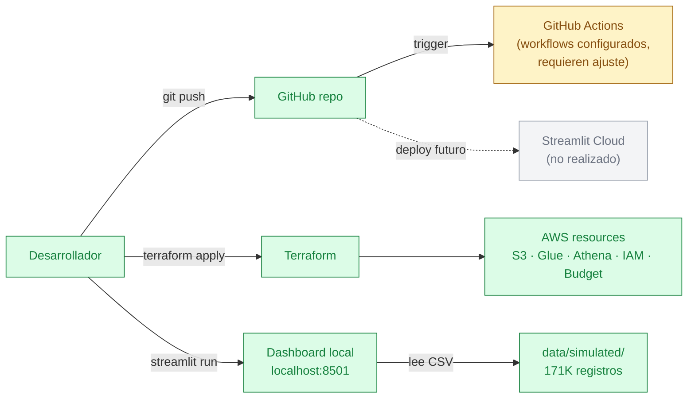

# 🌐 Despliegue — Customer Satisfaction Analytics

> 🟢 **AS-IS** — En el proyecto se usó **despliegue local** (Streamlit corrió con Python directo). El despliegue AWS está preparado con Terraform pero el dashboard no se conectó a él en producción.

## Flujo de despliegue



---

## 📊 **Opciones de Despliegue**

| Opción | Estado | Costo | Complejidad | Recomendación |
|--------|--------|-------|-------------|---------------|
| **🔵 Local** | ✅ **ACTIVO** | $0.00 | Baja | **Desarrollo** |
| **🟡 Streamlit Cloud** | 🔄 **EN EVALUACIÓN** | $0.00 | Media | **Demo público** |
| **🟠 AWS** | ⚠️ **PREPARADO** | $0.00 | Alta | **Producción** |

---

## 🔵 **Despliegue Local (RECOMENDADO)**

### **¿Por qué usar despliegue local?**
- ✅ **0% dependencias externas**
- ✅ **Control total del entorno**
- ✅ **Datos únicos por desarrollador** (no conflictos)
- ✅ **Desarrollo independiente**
- ✅ **Sin límites de uso**
- ✅ **Debugging completo**

### **🚀 Guía de Instalación Paso a Paso**

#### **Paso 1: Clonar Repositorio**
```bash
# Clonar desde GitHub
git clone https://github.com/MilaPacompiaM/customer-satisfaction-analytics.git

# Entrar al directorio
cd customer-satisfaction-analytics
```

#### **Paso 2: Configurar Python Virtual Environment**
```bash
# Crear entorno virtual
python -m venv .venv

# Activar entorno virtual (Windows)
.venv\Scripts\activate

# Verificar Python
python --version
# Debería mostrar: Python 3.x.x
```

#### **Paso 3: Instalar Dependencias**
```bash
# Instalar dependencias mínimas
pip install -r requirements-streamlit.txt

# Verificar instalación
pip list | findstr streamlit
# Debería mostrar: streamlit 1.x.x
```

#### **Paso 4: Generar Datos Simulados** (Solo primera vez)
```bash
# Ejecutar simulador
python scripts/data_simulator.py

# Verificar archivos generados
dir data\simulated\
```
> ⚠️ **IMPORTANTE**: Los datos simulados son únicos para cada ejecución. Para trabajo colaborativo, ejecutar solo **UNA VEZ** por equipo y compartir los archivos CSV generados.

#### **Paso 5: Ejecutar Dashboard**
```bash
# Opción A: Script rápido (Windows)
run_dashboard.bat

# Opción B: Manual
streamlit run streamlit_app.py

# Opción C: Puerto específico
streamlit run streamlit_app.py --server.port 8502
```

#### **Paso 6: Acceso y Verificación**
- **URL Principal**: http://localhost:8501
- **URL de Red**: http://192.168.18.15:8501
- **Dashboard alternativo**: http://localhost:8502

### **🔧 Comandos de Desarrollo**

```bash
# Activar entorno (cada sesión)
.venv\Scripts\activate

# Ejecutar con hot-reload
streamlit run streamlit_app.py --runner.magicEnabled=true

# Ver logs en tiempo real
streamlit run streamlit_app.py --logger.level=debug

# Ejecutar en puerto específico
streamlit run streamlit_app.py --server.port 8503

# Regenerar datos (desarrollo)
python scripts/data_simulator.py
```

### **📂 Estructura de Datos Local**
```
data/simulated/          # Generados por data_simulator.py
├── clientes.csv         # 📊 Base de clientes (1,000 registros)
├── llamadas_call_center.csv     # 📞 Interacciones telefónicas
├── mensajes_whatsapp.csv        # 💬 Conversaciones chat  
├── tickets_soporte.csv          # 🎯 Casos de soporte
├── encuestas_post_atencion.csv  # 📝 Feedback clientes
├── resenas_online.csv           # ⭐ Reseñas y ratings
├── libro_reclamaciones.csv      # 📋 Quejas y reclamos
└── resumen_generacion.json      # 📈 Metadatos generación
```

---

## 🟡 **Despliegue en Streamlit Cloud**

### **📋 Investigación de Requisitos**

#### **Según documentación oficial de Streamlit**:
- ✅ **Repositorio público en GitHub** (requerido)
- ✅ **Archivo Python principal** en raíz (tenemos `streamlit_app.py`)
- ✅ **requirements.txt** (tenemos `requirements-streamlit.txt`)
- ❓ **Permisos de colaborador vs owner** (investigando)

#### **Estado Actual del Repositorio**:
- **Owner**: MilaPacompiaM
- **Colaborador**: Edgardo (tú)
- **Visibilidad**: Público ✅
- **Archivo principal**: ✅ `streamlit_app.py`
- **Dependencies**: ✅ `requirements-streamlit.txt`

### **🔍 Opciones para Deploy**

#### **Opción A: Deploy Directo (Si tienes permisos)**
1. Ir a: https://share.streamlit.io/
2. Conectar GitHub
3. Seleccionar: `MilaPacompiaM/customer-satisfaction-analytics`
4. **Main file path**: `streamlit_app.py`
5. **Python version**: 3.9
6. **Requirements file**: `requirements-streamlit.txt`

#### **Opción B: Fork Repository (Alternativa)**
```bash
# 1. Fork en GitHub UI
# Ir a: https://github.com/MilaPacompiaM/customer-satisfaction-analytics
# Click "Fork"

# 2. Clonar tu fork
git clone https://github.com/TU_USUARIO/customer-satisfaction-analytics.git

# 3. Deploy desde tu fork
# URL: streamlit.io → TU_USUARIO/customer-satisfaction-analytics
```

### **⚠️ Limitaciones Streamlit Cloud**
- **Recursos**: 1GB RAM, tiempo limitado
- **Storage**: No persistente entre deployments
- **Datos**: Solo los incluidos en el repo
- **Custom domains**: Solo en planes pagos

### **🔧 Configuración para Streamlit Cloud**

#### **Archivo principal optimizado** (`streamlit_app.py`):
```python
# ✅ YA CONFIGURADO
# Importa correctamente desde subdirectorio
# Maneja errores de AWS automáticamente  
# Usa datos simulados como fallback
```

#### **Dependencies optimizadas** (`requirements-streamlit.txt`):
```
# ✅ SOLO LO ESENCIAL
streamlit>=1.28.0
pandas>=2.0.0
plotly>=5.17.0
numpy>=1.24.0
boto3>=1.29.0  # Opcional para AWS
faker>=20.0.0  # Para datos simulados
```

#### **Configuración tema** (`.streamlit/config.toml`):
```toml
# ✅ YA CONFIGURADO
[theme]
primaryColor = "#1f77b4"
backgroundColor = "#ffffff"
secondaryBackgroundColor = "#f0f2f6"
textColor = "#262730"
```

---

## 🟠 **Despliegue AWS (Producción)**

### **🎯 Estado Actual**
- ✅ **Terraform configurado** y probado
- ✅ **Free Tier architecture** diseñada
- ✅ **Cost controls** implementados
- ⚠️ **Deploy pendiente** de aprobación del equipo

### **📦 Componentes AWS a Deployar**

#### **S3 Buckets (3)**
```bash
# Data Lake principal
customer-satisfaction-analytics-data-lake-dev-[RANDOM]

# Resultados Athena  
customer-satisfaction-analytics-athena-results-[RANDOM]

# Logs CloudWatch
customer-satisfaction-analytics-logs-[RANDOM]
```

#### **Analytics Stack**
- **AWS Athena**: Query engine SQL
- **AWS Glue**: Data catalog y ETL
- **CloudWatch**: Monitoring y logs

#### **Security & Cost**
- **IAM Roles**: Acceso granular
- **Budget Alerts**: Email si costo >$0.50
- **Lifecycle Policies**: Auto-cleanup

### **🚀 Procedimiento Deploy AWS**

#### **Pre-requisitos**
```bash
# 1. AWS CLI instalado y configurado
aws configure
# Access Key: [PROPORCIONADO POR ADMIN]
# Secret Key: [PROPORCIONADO POR ADMIN]
# Region: us-east-1

# 2. Terraform instalado
# Descargar desde: https://terraform.io/downloads
```

#### **Deployment Steps**
```bash
# 1. Ir al directorio terraform
cd infra/terraform/

# 2. Inicializar Terraform
terraform init

# 3. Ver plan de deployment (SIN EJECUTAR)
terraform plan
# Review: Todos los recursos, costos estimados

# 4. Aplicar infrastructure (SOLO CON APROBACIÓN)
terraform apply
# Type: yes

# 5. Verificar deployment
aws s3 ls
aws athena list-data-catalogs
```

#### **Post-Deployment**
```bash
# 1. Subir datos simulados a S3
python scripts/upload_to_s3.py

# 2. Configurar Glue crawler
aws glue start-crawler --name customer-satisfaction-crawler

# 3. Verificar tablas Athena
aws athena list-table-metadata --catalog-name AwsDataCatalog --database-name default

# 4. Actualizar Streamlit para usar AWS
# Modificar analytics/streamlit_dashboard/app.py
# Cambiar: USE_AWS = True
```

---

## 🔒 **Consideraciones de Seguridad**

### **Local Development**
- ✅ **Datos simulados** (sin información real)
- ✅ **Virtual environment** (aislamiento)
- ✅ **Git ignore** configurado (.venv, datos sensibles)

### **Streamlit Cloud**
- ⚠️ **Datos públicos** (solo simulados)
- ⚠️ **Código público** (open source)
- ✅ **No credentials** en código

### **AWS Production**
- ✅ **IAM roles** granulares
- ✅ **S3 encryption** habilitado
- ✅ **VPC endpoints** (opcional)
- ✅ **CloudTrail** logging

---

## 📊 **Monitoreo de Deployments**

### **Local**
```bash
# Ver logs Streamlit
# Los logs aparecen en la terminal

# Verificar uso recursos
# Task Manager → python.exe

# Restart dashboard
# Ctrl+C → streamlit run streamlit_app.py
```

### **Streamlit Cloud**
```bash
# URL dashboard
https://customer-satisfaction-analytics-[hash].streamlit.app

# Logs en Streamlit Cloud UI
# Ver desde dashboard web

# Restart automático
# Al hacer push a GitHub
```

### **AWS**
```bash
# CloudWatch logs
aws logs describe-log-groups

# S3 usage
aws s3api list-objects --bucket [BUCKET_NAME] --query 'sum(Contents[].Size)'

# Athena query history  
aws athena list-query-executions

# Cost monitoring
python scripts/aws_cost_monitor.py
```

---

## 🆘 **Troubleshooting**

### **Error: ModuleNotFoundError**
```bash
# Verificar virtual environment activo
where python
# Debe mostrar: C:\...\customer-satisfaction-analytics\.venv\Scripts\python.exe

# Reinstalar dependencies
pip install -r requirements-streamlit.txt
```

### **Error: Port already in use**
```bash
# Usar puerto diferente
streamlit run streamlit_app.py --server.port 8502

# Matar proceso en puerto 8501
netstat -ano | findstr :8501
taskkill /PID [PID_NUMBER] /F
```

### **Error: No data files**
```bash
# Regenerar datos simulados
python scripts/data_simulator.py

# Verificar archivos
dir data\simulated\
```

### **AWS Connection Errors**
```bash
# ✅ NORMAL: La app usa datos simulados automáticamente
# Ver warning amarillo en dashboard
# No afecta funcionamiento local
```

---

## 📋 **Checklist Pre-Deploy**

### **Local (Desarrollo)**
- [ ] Python 3.8+ instalado
- [ ] Git clonado correctamente
- [ ] Virtual environment creado y activado
- [ ] Dependencies instaladas
- [ ] Datos simulados generados
- [ ] Dashboard funcionando en http://localhost:8501

### **Streamlit Cloud (Demo)**
- [ ] Repositorio GitHub público
- [ ] Permisos confirmados (owner/colaborador)
- [ ] `streamlit_app.py` en raíz
- [ ] `requirements-streamlit.txt` optimizado
- [ ] Datos incluidos en repo (simulados)

### **AWS (Producción)**
- [ ] AWS credentials configuradas
- [ ] Terraform instalado
- [ ] Plan terraform reviewado
- [ ] Budget alerts configuradas
- [ ] Aprobación del equipo obtenida

---

## 🎯 **Recomendación Final**

### **Para Desarrollo (AHORA)**
```bash
# ✅ USAR LOCAL DEVELOPMENT
.venv\Scripts\activate
streamlit run streamlit_app.py
```
**Ventajas**: Control total, sin límites, debugging completo

### **Para Demo (FUTURO)**
```bash
# 🔄 EVALUAR STREAMLIT CLOUD
# Pending: Confirmar permisos fork
```
**Ventajas**: URL pública, sin infraestructura

### **Para Producción (CUANDO SE APRUEBE)**
```bash
# ⚠️ AWS DEPLOYMENT  
# Pending: Aprobación equipo
cd infra/terraform && terraform apply
```
**Ventajas**: Escalabilidad, seguridad enterprise, datos reales

---

[🔙 Volver al README principal](./README.md) | [🏗️ Ver Infraestructura](./INFRAESTRUCTURA.md)
