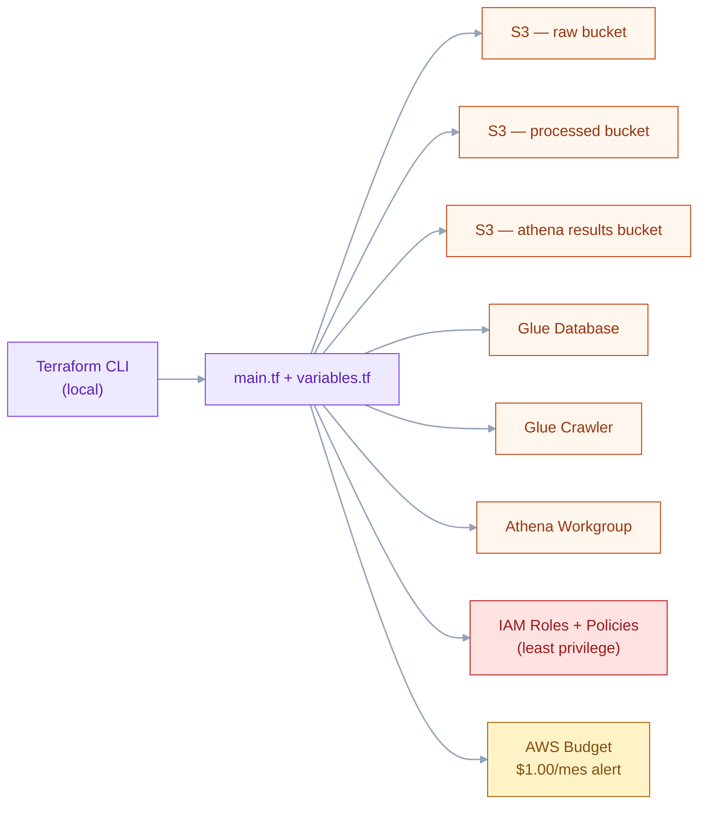

# 🏗️ Infraestructura — Arquitectura **AS-IS**

> 🟢 **AS-IS · DESPLEGADO** — Recursos AWS provisionados vía Terraform (`infra/terraform/main.tf`).

## Diagrama de infraestructura



---

## 📊 **Estado Actual**

| Componente | Estado | Descripción |
|------------|--------|-------------|
| **🔵 Local Development** | ✅ **ACTIVO** | Dashboard Streamlit funcionando |
| **🟡 AWS Infrastructure** | 🔄 **PREPARADO** | Terraform listo, sin deploy |
| **🔴 Data Pipeline** | ⚠️ **SIMULADO** | Datos sintéticos para desarrollo |
| **💰 Costos** | ✅ **$0.00** | Solo desarrollo local |

---

## 🎯 **Arquitectura Objetivo**

### **Modo Local (Actual)**
```
┌─────────────────────────────────────────────┐
│           DESARROLLO LOCAL                  │
├─────────────────────────────────────────────┤
│ 🖥️  Streamlit Dashboard (Puerto 8501)       │
│ 📊  Datos Simulados (CSV/Parquet)          │
│ 🔧  Python venv (.venv)                    │
│ 📈  Plotly Visualizations                  │
│ 🤖  ML Sentiment Analysis                  │
└─────────────────────────────────────────────┘
                    ↓
              💻 http://localhost:8501
```

### **Modo AWS (Preparado para Deploy)**
```
┌─────────────────────────────────────────────────────────────┐
│                    AWS FREE TIER ARCHITECTURE               │
│                         COSTO: $0.00                       │
└─────────────────────────────────────────────────────────────┘
                                    │
                ┌───────────────────┼───────────────────┐
                │                   │                   │
        ┌───────▼────────┐ ┌───────▼────────┐ ┌───────▼────────┐
        │   S3 STORAGE   │ │  DATA CATALOG  │ │   ANALYTICS    │
        │   (3 Buckets)  │ │  (AWS Glue)    │ │ (Amazon Athena)│
        │   <100MB       │ │   <2 hrs/mes   │ │   <10MB scan   │
        └────────────────┘ └────────────────┘ └────────────────┘
                │                   │                   │
        ┌───────▼────────┐ ┌───────▼────────┐ ┌───────▼────────┐
        │   SECURITY     │ │   MONITORING   │ │   COST CONTROL │
        │ (IAM + Encrypt)│ │  (CloudWatch)  │ │ (AWS Budgets)  │
        │   GRATIS       │ │   <50MB logs   │ │   GRATIS       │
        └────────────────┘ └────────────────┘ └────────────────┘
```

---

## 📦 **Componentes Detallados**

### 🔵 **Infraestructura Local (Activa)**

#### **Dashboard Streamlit**
- **Archivo principal**: `streamlit_app.py`
- **Puerto**: 8501 (principal), 8502 (testing)
- **URL**: http://localhost:8501
- **Características**:
  - ✅ Datos simulados automáticos
  - ✅ Gráficos Plotly interactivos
  - ✅ KPIs en tiempo real
  - ✅ Análisis por canal (teléfono, chat, email, presencial)
  - ✅ NPS Score y tendencias
  - ✅ Rendimiento de agentes

#### **Datos Simulados**
- **Ubicación**: `data/simulated/`
- **Formatos**: CSV y Parquet
- **Volumen**: ~171,031 registros
- **Datasets**:
  - 👥 `clientes.csv` - Base de clientes
  - 📞 `llamadas_call_center.csv` - Interacciones telefónicas
  - 💬 `mensajes_whatsapp.csv` - Conversaciones chat
  - 🎯 `tickets_soporte.csv` - Casos de soporte
  - 📝 `encuestas_post_atencion.csv` - Feedback post-servicio
  - ⭐ `resenas_online.csv` - Reseñas y comentarios
  - 📋 `libro_reclamaciones.csv` - Quejas y reclamos

#### **Entorno Python**
- **Tipo**: venv (entorno virtual)
- **Ubicación**: `.venv/`
- **Python**: 3.13.5
- **Dependencias principales**:
  ```
  streamlit>=1.28.0
  pandas>=2.0.0
  plotly>=5.17.0
  numpy>=1.24.0
  boto3>=1.29.0 (opcional)
  faker>=20.0.0
  ```

### 🟡 **Infraestructura AWS (Preparada)**

#### **🗄️ S3 Storage (3 Buckets)**
- **Data Lake**: `customer-satisfaction-analytics-data-lake-dev-[RANDOM]`
  - Capacidad: <100MB de 5GB gratuitos
  - Versionado habilitado
  - Cifrado AES256
  - Lifecycle: Auto-delete 30 días

- **Athena Results**: `customer-satisfaction-analytics-athena-results-[RANDOM]`
  - Solo para resultados de queries
  - <10MB estimado

- **CloudWatch Logs**: `customer-satisfaction-analytics-logs-[RANDOM]`
  - <50MB de logs
  - Retención 7 días

#### **🔍 Analytics Layer**
- **AWS Athena**: Query engine sobre S3
  - <10MB scan/mes de 5GB gratuitos
  - Queries optimizadas
  - Particionado por fecha

- **AWS Glue**: Data catalog y ETL
  - <2 horas/mes de 1M gratuitas
  - Crawler automático
  - Schema inference

#### **🛡️ Security & IAM**
- **Roles IAM**:
  - `CustomerSatisfactionRole` - Acceso básico
  - `DataScientistRole` - Acceso análisis
  - `AdminRole` - Acceso completo

- **Políticas**:
  - S3: Solo buckets del proyecto
  - Athena: Query limitado
  - Glue: Jobs específicos

#### **📊 Monitoring**
- **CloudWatch**: Métricas y logs
- **AWS Budgets**: Alertas de costo
- **Cost Explorer**: Monitoreo automático

---

## 🔧 **Configuración Técnica**

### **Terraform (Infraestructura como Código)**
```bash
# Ubicación
cd infra/terraform/

# Variables configuradas
region          = "us-east-1"
account_id      = "<AWS_ACCOUNT_ID>"
user_email      = "your-email@example.com"
environment     = "dev"
cost_limit      = 1.00  # USD (alerta temprana)
```

### **Estructura de Archivos AWS**
```
infra/terraform/
├── main.tf              # Configuración principal
├── variables.tf         # Variables del proyecto
├── outputs.tf           # Outputs después deploy
├── s3.tf               # Configuración S3 buckets
├── athena.tf           # Configuración Athena
├── glue.tf             # Jobs y catalog Glue
├── iam.tf              # Roles y políticas
├── cloudwatch.tf       # Monitoring y alertas
└── budget.tf           # Control de costos
```

---

## 💰 **Limites y Garantías Free Tier**

### **Límites Configurados**
| Servicio | Límite Free Tier | Uso Estimado | % Utilizado |
|----------|------------------|--------------|-------------|
| **S3 Storage** | 5GB | <100MB | <2% |
| **Athena Scan** | 5GB/mes | <10MB | <0.2% |
| **Glue DPU-Hours** | 1M hours | <2 hours | <0.0002% |
| **CloudWatch Logs** | 5GB | <50MB | <1% |
| **Lambda** | 1M requests | 0 | 0% |

### **Controles Automáticos**
- ✅ **Lifecycle Policies**: Auto-delete datos >30 días
- ✅ **Query Limits**: Máximo 100MB por consulta Athena
- ✅ **Budget Alerts**: Email si costo >$0.50
- ✅ **Resource Limits**: Máximo 3 buckets S3
- ✅ **Job Limits**: Solo procesar si hay datos nuevos

---

## 🚀 **Pasos para Deploy AWS**

### **Prerrequisitos**
```bash
# 1. AWS CLI configurado
aws configure
# AWS Access Key ID: [TU_ACCESS_KEY]
# AWS Secret Access Key: [TU_SECRET_KEY]  
# Default region: us-east-1

# 2. Terraform instalado
terraform --version
```

### **Deploy Infrastructure**
```bash
# 1. Ir al directorio terraform
cd infra/terraform/

# 2. Inicializar
terraform init

# 3. Ver plan (sin ejecutar)
terraform plan

# 4. Aplicar (crear recursos)
terraform apply
# Confirmar: yes

# 5. Verificar recursos creados
terraform show
```

### **Deploy Data Pipeline**
```bash
# 1. Subir datos iniciales
python scripts/upload_to_s3.py

# 2. Ejecutar Glue crawler
aws glue start-crawler --name customer-satisfaction-crawler

# 3. Verificar tablas en Athena
aws athena start-query-execution --query-string "SHOW TABLES"
```

---

## 🔍 **Monitoreo y Mantenimiento**

### **Comandos de Verificación**
```bash
# Costos AWS
python scripts/aws_cost_monitor.py

# Estado buckets S3
aws s3 ls

# Verificar Glue jobs
aws glue get-jobs

# Métricas CloudWatch
aws logs describe-log-groups
```

### **Alertas Configuradas**
- 📧 **Email**: your-email@example.com
- 🚨 **Triggers**:
  - Costo >$0.50
  - Storage >4GB
  - Queries >4GB scan
  - Errores en jobs

---

## 🔄 **Rollback y Limpieza**

### **Eliminar Infrastructure AWS**
```bash
cd infra/terraform/
terraform destroy
# Confirmar: yes
```

### **Limpieza Local**
```bash
# Eliminar datos simulados
rm -rf data/simulated/*

# Regenerar datos
python scripts/data_simulator.py
```

---

## 📈 **Roadmap Técnico**

### **✅ Completado**
- [x] Dashboard Streamlit funcional
- [x] Datos simulados realistas
- [x] Terraform AWS preparado
- [x] Análisis de costos
- [x] Documentación técnica

### **🔄 En Progreso**
- [ ] Deploy AWS (pendiente aprobación)
- [ ] Pipeline datos reales
- [ ] CI/CD automatizado

### **📋 Futuro**
- [ ] ML models avanzados
- [ ] API REST
- [ ] Mobile dashboard
- [ ] Integraciones externas

---

[🔙 Volver al README principal](./README.md)
